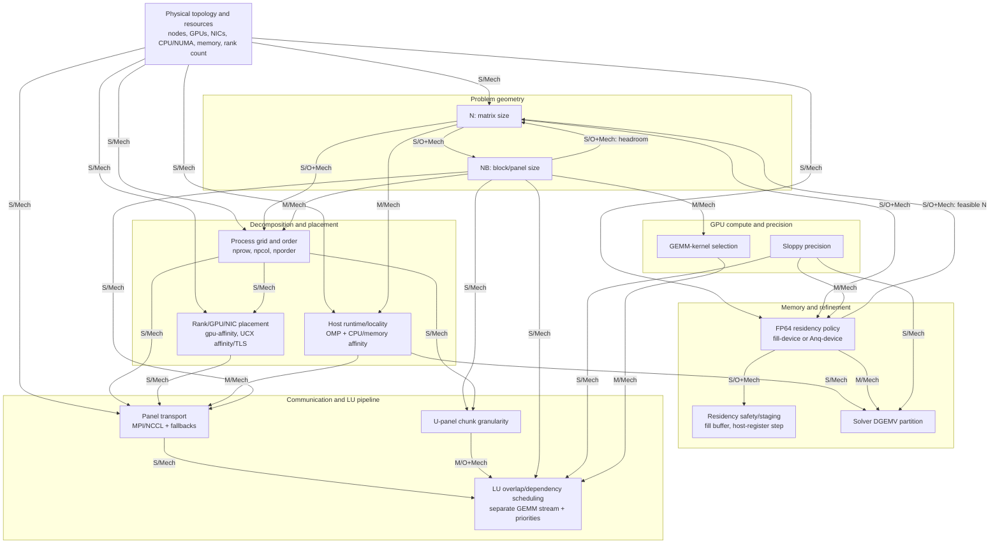

# HPL-MxP Parameter Dependency Graph from the 8×H200 Work

Scope: NVIDIA HPL-MxP v26.02 on one GAAS node with eight H200 GPUs. This is
an optimization-dependency model, not a new optimization blueprint. An arrow
`X → Y` means that X should normally be established before Y and that a
material change to X can invalidate Y's tuning conclusion. It does not assert
strict mathematical causality.

Evidence labels are deliberately strict:

- `OBSERVED`: the repository contains a cross-context, factorial, or trace
  comparison that bears directly on the interaction. A main effect at only
  one fixed control is not enough by itself.
- `MECHANISTIC`: the dependency follows from the blocked LU/refinement
  algorithm or the CPU/GPU/network/memory hierarchy, but the interaction was
  not isolated experimentally.
- `UNCERTAIN`: the interaction is plausible and important, but the available
  experiment design cannot establish its sign or materiality.

## 1. Parameter/Subsystem Inventory

The inventory separates parameters actually varied from important controls
that were held fixed. Numerical winners are statements about this 8×H200
single-node workload only.

| Subsystem | Parameter or group | What it controls / main mechanism | Strongest 8×H200 insight |
|---|---|---|---|
| Problem geometry | `--n` (`N`) | Global matrix dimension; cubic useful work, quadratic storage, GEMM size, panel-overhead amortization, and refinement volume. | Raising N from 370000 to 490000 at `NB=1024` improved the score by 26.75%, followed by a hard host/device memory wall at 510000. Under the later fill-device control, lowering N shortened the solver but lost LU efficiency, so there was no net peak below 491520. [N sweep](../analysis/n-sweep-370k-510k.md), [residency/N study](../analysis/matrix-placement-N-resweep.md) |
| Problem geometry | `--nb` (`NB`) | Block/panel width; changes panel count and size, trailing-GEMM shapes, synchronization frequency, workspace, and communication granularity. | At N=490000, 1024→3072 cut LU time by about 6.4 s and raised performance 18.77% over the fixed-N control. 3072–6144 was a broad plateau; 7168/8192 regressed and headroom fell sharply. The absolute value 3072 is not universal. [NB sweep](../analysis/nb-sweep.md), [M1 interpretation](../consolidate_m1.md) |
| Decomposition | MPI rank count; `--nprow`, `--npcol`, `--nporder` | Rank count sets available parallelism; P×Q defines process rows/columns and panel/update communicators; order maps ranks into the logical grid. | Rank count stayed fixed at eight. At N=399360, 4×2 column was best; at N=491520, 2×4 row was best, although the latter full spread was only about 1.8%. This is direct warning that grid conclusions are context-dependent. [Grid study](../analysis/np-sweep.md) |
| Device and network placement | `--gpu-affinity`; `--ucx-affinity`, `--ucx-tls` | Maps logical ranks to GPUs and network devices/transports; determines whether process-row/column traffic follows favorable NVSwitch, PCIe, NUMA, and NIC paths. | GPU affinity was always the identity map `0:...:7`; no alternate GPU map was tested. UCX/NIC controls were not swept. Their apparent irrelevance is therefore not an experimental result. [Tuning guide](../../HPL_MxP_TuningParam_Guide.md) |
| Host runtime and locality | `--cpu-affinity`, `--mem-affinity`; `OMP_NUM_THREADS`, `OMP_PLACES`, `OMP_PROC_BIND`; fixed host-thread support | Supplies CPU work for launches, MPI progress, panel/auxiliary work, data movement, and refinement; controls core and NUMA contention. | Explicit HPL CPU/memory affinity did not help at the tested control; fewer than eight cores/rank was disastrous. Separately, OpenMP 8 threads with socket placement was about 5.15% above the pre-OMP reference. `cores` plus binding collapsed because ranks oversubscribed low-numbered cores. [Affinity](../analysis/affinity-491k.md), [OpenMP](../analysis/omp-sweep.md) |
| FP64 residency | `--fill-device`, `--Anq-device` | Chooses how much of the original FP64 matrix remains device-resident for residual/refinement work. `fill-device` overrides `Anq-device`. | Fill-device was a defensible approximately 2–3% gain at N=491520, but the direct off/on pair was node-confounded. `Anq-device` was held at zero and never swept. [Matrix placement](../analysis/matrix-placement-491k.md) |
| Residency safety and staging | `--fill-device-buffer-size`, `--cuda-host-register-step` | Buffer reserves VRAM for workspaces/runtime; registration step batches pinned host FP64 columns and trades registration overhead against transfer efficiency. | Buffer 1024–2048 MB was a safe, flat region; 512/256 MB caused stalled residuals and failed verification. Register-step changes were within noise in two placement contexts. [Matrix placement](../analysis/matrix-placement-491k.md) |
| Panel communication | `--use-mpi-panel-broadcast`; diagnostic `--mpi-use-mpi`, `--use-host-mpi` | Selects the MPI/NCCL panel-broadcast mix, MPI fallback, or host-staged MPI. This changes GPU collective work, MPI traffic, progress, and synchronization. | A clean 0/25/50/75/100 sweep was inside 2.6% same-job drift. Nsight nevertheless confirmed real transport substitution: MPI-heavy policy reduced NCCL broadcast time but increased MPI and stream waits. Fallback/host MPI were not swept. [Communication study](../analysis/mpi-nccl-coms-sweep.md), [trace study](../mpi_panel_broadcast_effect.md) |
| U-panel granularity | `--u-panel-chunk-nbs` | Chunks U-panel work in units of NB; trades readiness/overlap against launch, collective, and scheduling overhead. | Values 4/8/16 were performance-flat at broadcasts 50 and 75. Chunk 4 increased dominant-kernel launches about 76.5% and NCCL launches about 5.9%, proving a structural change without a shorter clean critical path. [Chunk study](../panel_u_chunk_effect.md) |
| LU dependency scheduling | `--prioritize-factorization`, `--prioritize-trsm` | Makes GEMMs wait for the whole factorization or only U-side TRSM, advancing dependency-producing work on the LU critical path. | The 2×2 same-job test isolated factorization priority: LU 20.38→19.12 s and end-to-end +3.54%. TRSM priority was neutral in both factorization states. The retained factorization result still lacks a bracketed repeat on another allocation. [Priority study](../analysis/factorization-priority.md) |
| GPU concurrency | `--use-separate-stream-for-gemm` | Places GEMM on a dedicated CUDA stream, permitting overlap where dependencies and resources allow. | Disabling the stream, while factorization priority was enabled, cost 3.73% in LU rate and 1.89% end-to-end. It was not tested factorially with factorization priority. [Stream study](../analysis/separate-stream-for-gemm.md) |
| Solver-side host work | `--call-dgemv-with-multiple-threads` | Partitions host DGEMV by rows/thread in the refinement path; competes for CPU/cache/NUMA and MPI progress resources. | At OMP=8/socket placement, every nonzero tested value slowed the solver by 1.05–4.70 s while LU and convergence stayed flat; zero was best. [DGEMV study](../analysis/dgemv-with-multiple-threads.md) |
| GPU compute and numerical path | `--sloppy-type`, `--preset-gemm-kernel` | Selects low-precision type/preconditioner quality and the GEMM implementation; changes tensor-core throughput, data volume, kernel duration, refinement iterations, and possibly memory demand. | All scored work used FP16. The effective preset was 90 in the profiled final control and the dominant kernel was SM90 `nvjet`; neither sloppy type nor alternative supported presets were swept. No winning conclusion exists. [Compute/scheduling evidence](../optimization_plan_1.md) |
| Validation / measurement controls | `--tolerance`, `--skip-tests 1`, GPU monitoring flags, loop/repetition policy | Defines correctness acceptance and observability rather than the mathematical optimization. | All optimization runs were required to pass finite-residual verification. Low fill buffers demonstrate why invalid runs cannot be ranked. Most candidates still have one clean measurement; bracketing controls exposed drift as large as the effects of several flags. [M2 consolidation](../consolidate_m2.md) |

Parameters in the last three rows that were fixed or diagnostic are included
because changing them can reopen a downstream conclusion even though they did
not supply a completed sweep.

## 2. Dependency Graph

Graph labels use `S`, `M`, and `W` for strong, moderate, and weak/conditional;
`O`, `Mech`, and `U` mean observed, mechanistic, and uncertain. `O+Mech`
means that both experiment evidence and a system mechanism support the edge.
The high-level graph deliberately groups flags that share the same dependency
structure; internal group interactions are expanded in the edge table.

Textual reading order:

1. Establish the hardware/resource envelope and MPI rank count.
2. Treat `N` and `NB` as a coupled geometry/memory pair, not independent
   permanent decisions.
3. Establish the process grid/order, then map its ranks to GPUs, NICs, CPUs,
   and memory domains.
4. Establish FP64 residency and safe headroom before fine staging controls.
5. With geometry and placement stable, interpret panel transport and U-panel
   chunking; only then interpret LU stream/priority behavior.
6. Precision and GEMM-kernel changes can reopen both scheduling and refinement
   conclusions because they change the relative lengths of those paths.

This is a dependency order, not the requested future sweep blueprint.

## 3. Dependency Edge Table

`Fully re-sweep` means the old downstream conclusion should be considered
open. `Lightly revalidate` means repeat controls and a small representative
set. `Normally keep closed` applies only while the upstream conditions remain
inside the tested regime.

| ID | Upstream parameter/group | Downstream parameter/group | Strength | Evidence | Why dependency exists | Revisit implication |
|---|---|---|---|---|---|---|
| E01 | Physical topology/resources and rank count | `N` | Strong | MECHANISTIC | Aggregate/per-rank host and device memory, rank-local work, and communication overhead set the safe useful problem size. | Fully re-establish feasible N after node/GPU count or memory-policy changes. |
| E02 | Physical topology/resources and rank count | Process grid/order | Strong | MECHANISTIC | Valid P×Q factors and the meaning of row/column groups change with rank count and node boundaries. | Fully re-sweep grid/order after moving 8→12 ranks or 1→3 nodes. |
| E03 | Physical topology/resources | Rank/GPU/NIC placement | Strong | MECHANISTIC | GPU numbering, NVLink/NVSwitch islands, PCIe roots, NUMA domains, NIC rails, and cpusets are machine-specific. | Fully remap placement; never copy the `0:...:7` or UCX assumptions blindly. |
| E04 | Physical topology/resources and ranks/node | Host runtime/locality | Strong | MECHANISTIC | Ranks compete for a different CPU/core/NUMA budget and MPI progress changes across nodes. | Fully re-sweep thread count/placement; rediscover the allocated cpuset. |
| E05 | Physical topology/resources | FP64 residency policy | Strong | MECHANISTIC | VRAM/rank, host memory/rank, runtime workspaces, and interconnect paths determine the value and safety of device residency. | Fully re-establish fill/partial-residency policy and headroom. |
| E06 | Physical topology/resources | Panel transport | Strong | MECHANISTIC | Crossing node/NIC boundaries changes latency, bandwidth, progress, collectives, and GPU-direct behavior. | Fully re-sweep communication policy on multinode; single-node flatness is closed only locally. |
| E07 | `N` | `NB` | Strong | OBSERVED + MECHANISTIC | N changes panel count, trailing-update sizes, amortization, and memory pressure. NB=3072 held up at two Ns, but was not re-swept under the final controls. [NB evidence](../analysis/nb-sweep.md) | Fully re-sweep NB after a major N change; lightly revalidate for small N movement away from a memory boundary. |
| E08 | `NB` | `N` / memory boundary | Strong | OBSERVED + MECHANISTIC | Larger NB requires more workspace: the observed OOM boundary moved from 510000 at NB=1024 to 506880 at NB=3072. [Aligned-N evidence](../analysis/N-NB-resweep.md) | Recheck safe N and headroom after every material NB or workspace change. |
| E09 | `N` | Process grid/order | Strong | OBSERVED + MECHANISTIC (qualified) | The measured preference reversed from 4×2 column at N=399360 to 2×4 row at N=491520. Later controls and cross-node noise differ, so direction and size are not cleanly isolated. [Grid evidence](../analysis/np-sweep.md) | Fully re-sweep grid after a material N change; do not preserve the old winner. |
| E10 | `NB` | Process grid/order | Moderate | MECHANISTIC | Block-cyclic ownership, panels/rank, local update shapes, and communicator traffic depend jointly on NB and P×Q. Only NB=3072 was used in the final grid sweep. | Lightly revalidate grid after a modest NB change; fully re-sweep after a large change. |
| E11 | Process grid/order | Rank/GPU/NIC placement | Strong | MECHANISTIC | Order assigns physical ranks to logical row/column neighbors; the same affinity list can create different paths under another grid/order. | Rebuild the mapping for every serious grid candidate. |
| E12 | Process grid/order | Panel transport | Strong | MECHANISTIC | P and Q change communicator sizes, panel ownership, message fan-out, and inter-/intra-node traffic. Broadcast was swept only at 2×4 row. | Fully re-sweep panel transport after a material grid/topology change. |
| E13 | Rank/GPU/NIC placement | Panel transport | Strong | MECHANISTIC | MPI/NCCL performance depends on the physical GPU/NIC/NUMA route followed by logical communicators. | Fully revalidate transport after any rank/GPU/NIC remap. |
| E14 | `N` | FP64 residency policy | Strong | OBSERVED + MECHANISTIC | N² changes FP64 footprint. Under fill-device, reducing N from 491520 to 368640 cut solver time 13.07→4.09 s but reduced LU efficiency enough to erase the net gain. [Residency/N evidence](../analysis/matrix-placement-N-resweep.md) | Fully re-evaluate residency after a major N change and judge LU plus solver together. |
| E15 | FP64 residency policy | Feasible/useful `N` | Strong | OBSERVED + MECHANISTIC | Filling the GPU changes VRAM headroom and solver staging; unsafe reserves caused invalid refinement. | Recheck the N boundary and correctness whenever fill/Anq policy changes. |
| E16 | `--fill-device` / `--Anq-device` mode | Fill buffer | Strong | OBSERVED + MECHANISTIC | The buffer only governs fill-device headroom; too little reserve overflowed the intended residency and produced failed residuals. [Buffer evidence](../analysis/matrix-placement-491k.md) | Re-sweep a safe coarse buffer range after N, NB, release, or residency changes; correctness-gate every point. |
| E17 | Residency amount / host-resident fraction | Host-register step | Weak / conditional | OBSERVED + MECHANISTIC | Registration matters only for host-resident/staged FP64 data. Sweeps at two buffers found no stable winner above noise. [Placement evidence](../analysis/fp64-matrix-mem-placement.md) | Normally keep default closed; lightly revalidate only after a large residency or interconnect change. |
| E18 | `N` / per-rank refinement work | Host runtime/locality | Moderate | MECHANISTIC | Larger residual/refinement and launch workloads can shift the useful host-thread budget; only one large-N OpenMP sweep exists. | Lightly revalidate OMP at a materially different N or ranks/node. |
| E19 | CPU/memory affinity | OpenMP thread/place/bind policy | Strong | UNCERTAIN | Both act on the same cpuset and NUMA resources. They were optimized sequentially, not as a clean joint design; the early 10-thread failure mixed affinity and OpenMP settings. | Fully revalidate as a coordinated group on a new launcher/cpuset; do not combine old winners independently. |
| E20 | Host runtime/locality | DGEMV partition | Strong | MECHANISTIC | DGEMV threads share cores, caches, NUMA paths, and MPI progress resources. The negative DGEMV sweep used only OMP=8/socket placement. | Fully re-sweep only after a major host-runtime change; otherwise keep zero closed. |
| E21 | `N` and FP64 residency | DGEMV partition | Moderate | MECHANISTIC | DGEMV/refinement size and whether FP64 data is local to device/host determine whether partition overhead can be amortized. | Lightly revalidate after a large N/residency change or clear solver bottleneck shift. |
| E22 | `NB` | Panel transport | Strong | MECHANISTIC | NB changes panel message size/frequency and the latency-versus-bandwidth balance. The communication sweep used only NB=3072. | Fully re-sweep MPI/NCCL policy after a large NB change. |
| E23 | `NB` | U-panel chunk size | Strong | MECHANISTIC | Chunk units are NB blocks; changing NB changes bytes/chunk, number of chunks, kernel shapes, and readiness cadence. | Fully re-sweep chunk candidates after a large NB change. |
| E24 | `N`, `NB`, `npcol` | U-panel chunk validity/usefulness | Strong | MECHANISTIC | NVIDIA's documented constraint contains `(N/NB)/npcol/chunk`; the work per process column changes with all three. | Recalculate validity and fully re-evaluate chunk after geometry/grid changes. |
| E25 | Panel transport | U-panel chunk interpretation | Weak / conditional | OBSERVED + MECHANISTIC | Chunks 4/8/16 were compared at broadcasts 50 and 75 with no resolved performance interaction, although traces showed changed collective launch structure. [Communication matrix](../analysis/mpi-nccl-coms-sweep.md) | Normally keep 8 closed at the current control; lightweight joint revalidation after topology/grid changes. |
| E26 | Panel transport/readiness | LU stream and priority policy | Strong | MECHANISTIC | Priority and stream choices operate on readiness stalls created partly by communication; another transport/topology changes which dependency is critical. | Fully re-sweep priority/stream controls after moving multinode or materially changing transport. |
| E27 | U-panel chunk | LU stream and priority policy | Moderate | OBSERVED + MECHANISTIC | Chunk 4 changed kernel/collective launch counts and moved synchronization without shortening the clean path. This can change what stream/priority policy has to hide. [Trace evidence](../panel_u_chunk_effect.md) | Lightly revalidate scheduling after a major chunk change; keep closed for 4/8/16 at the present control. |
| E28 | `NB` | LU stream and priority policy | Strong | MECHANISTIC | Panel duration/frequency and GEMM duration determine whether factorization or TRSM is starved by updates. Priority was tested only at NB=3072. | Fully re-sweep scheduling after a large NB change. |
| E29 | Process grid/order | LU stream and priority policy | Moderate | MECHANISTIC | Panel ownership, rank arrival skew, and update concurrency change with P×Q. | Lightly revalidate after small grid changes; fully re-sweep across node-boundary changes. |
| E30 | Separate GEMM stream policy | Factorization/TRSM priority policy | Strong | MECHANISTIC + UNCERTAIN | Separate streams create concurrency; priority constrains it to protect the critical panel. The stream toggle was tested only with factorization priority on, so the interaction magnitude is unknown. | Treat them as a coupled scheduling group; use a factorial or targeted interaction check after either changes. |
| E31 | Factorization priority | TRSM priority interpretation | Moderate | OBSERVED + MECHANISTIC | The 2×2 experiment showed factorization priority's benefit in both TRSM states and no additive TRSM benefit. [2×2 evidence](../analysis/factorization-priority.md) | At the present control keep TRSM=0 closed; reopen after geometry/transport/precision changes. |
| E32 | Sloppy precision | LU scheduling and panel communication | Strong | MECHANISTIC | Precision changes GEMM/data-movement duration and preconditioner quality, shifting the balance between update work and panel readiness. No alternate precision was tested. | Fully re-sweep the highest-impact scheduling/communication controls after changing precision. |
| E33 | GEMM-kernel selection | LU scheduling | Moderate | MECHANISTIC | A faster/differently tiled GEMM changes how long updates occupy resources and whether they starve factorization. Only effective preset 90 was observed. | Lightly revalidate factorization priority and stream policy after a kernel change. |
| E34 | `NB` | GEMM-kernel selection | Moderate | MECHANISTIC | NB determines important GEMM shapes and K dimensions; a kernel/preset result need not transfer across blocks. | Lightly revalidate the kernel after NB changes and vice versa. |
| E35 | Sloppy precision | Solver/refinement and DGEMV policy | Strong | MECHANISTIC | Lower precision can weaken the LU preconditioner, increase refinement iterations, or fail convergence; that changes solver-side work. | Fully revalidate solver behavior, DGEMV conclusion, residuals, and end-to-end time after precision changes. |
| E36 | Sloppy precision | Memory headroom/residency | Moderate | MECHANISTIC | Low-precision factor/copy size and workspaces compete with FP64 residency and communication buffers. | Recheck VRAM headroom, safe fill buffer, and N feasibility after precision changes. |

A machine-readable copy of this table is provided in
[`edges.csv`](edges.csv). The CSV keeps the same evidence and revisit semantics
but omits Markdown citations.

## 4. Observed vs Mechanistic Dependencies

The numerical cross-check used [`results/metrics.csv`](../../results/metrics.csv)
and [`results/RESULTS.md`](../../results/RESULTS.md), with phase timing,
memory, residual, and configuration markers checked in the relevant raw
experiment outputs. The detailed reports linked below retain the attempt IDs,
PBS jobs, nodes, and raw-output paths. The two consolidation reports
([M1](../consolidate_m1.md), [M2](../consolidate_m2.md)) were used to reconcile
later corrections with earlier interpretations rather than simply inheriting
the latest winning configuration.

### Directly observed interaction evidence

- **`N ↔ NB` through capacity and LU granularity.** NB=3072 reduced LU time
  substantially at N=490000, and the larger workspace moved the observed OOM
  boundary below the NB=1024 boundary. This supports a dependency, but not a
  universal NB optimum.
- **`N → grid/order`, qualified.** The winner changed between the 399360
  and 491520 studies. Because the studies were cross-node and did not share
  every later control, the reversal is an observed warning to reopen the grid,
  not a clean quantitative interaction estimate.
- **`N ↔ FP64 residency`.** The fill-device N re-sweep directly showed a
  monotonic solver-time reduction at smaller N and a simultaneous LU-efficiency
  loss. It is the clearest observed cross-subsystem trade-off in the project.
- **Residency mode → buffer safety.** The low-buffer failures are a strong
  correctness dependency, not ordinary slow points. The exact 1024-versus-2048
  ranking remains unresolved.
- **Panel transport ↔ U-panel chunk was tested and weak here.** The partial
  joint matrix at broadcasts 50/75 and chunks 4/8/16 showed no clean
  end-to-end interaction. Nsight proved that both knobs changed execution
  structure even when score stayed flat.
- **Factorization priority ↔ TRSM priority was tested factorially.** The
  whole-factorization effect repeated across both TRSM states; TRSM added
  nothing. This is stronger than selecting a single maximum.

### Observed main effects that are not interaction proofs

- OpenMP socket placement was beneficial and narrow CPU binding was harmful,
  but explicit affinity and OpenMP were not jointly swept. Their edge remains
  uncertain rather than observed.
- The separate GEMM stream was useful with factorization priority enabled, but
  there is no stream×priority factorial evidence.
- DGEMV partitioning was harmful at one OMP/FP16/residency control. This does
  not prove it remains harmful under another host budget or refinement regime.
- Panel broadcast and chunk were flat at one N/NB/grid/topology. Their
  negative result is valuable but conditional.

### Mechanistic dependencies not isolated by these experiments

- Grid/order → GPU/NIC placement → panel transport.
- NB → message size/frequency, U-panel chunk bytes, GEMM shapes, and
  factorization/update scheduling balance.
- Host runtime → MPI progress and DGEMV partition usefulness.
- Sloppy precision → preconditioner quality, refinement work, residency
  pressure, and the relative value of scheduling controls.
- GEMM-kernel choice → update duration and factorization starvation.
- Node count/interconnect → all communication and rank-placement choices.

### Unknown or genuinely uncertain edges

- Whether coordinated CPU affinity plus the winning OpenMP socket policy is
  better or worse than leaving HPL affinity unset.
- Whether the final OpenMP/fill/factorization controls change the preferred
  NB or process grid.
- Whether factorization priority remains beneficial with another precision,
  NB, process grid, or inter-node panel path.
- Whether partial `Anq-device` residency has a useful region with
  `fill-device=0`.
- Whether any H200-supported preset differs beneficially from the effective
  preset 90.

The earlier `basic_param_sweep2.md` claim that N/NB divisibility was mandatory
should not be retained as a general rule. Repeated pathological 402423/403423
measurements showed that a specific case was real, but the later aligned-N
study found no general alignment benefit and several aligned points below the
unaligned reference. The transferable dependency is memory/work granularity,
not "always choose `N % NB == 0` for speed." [Early interpretation](../analysis/basic_param_sweep2.md),
[later correction](../analysis/N-NB-resweep.md)

## 5. Potentially Missed Interactions

1. **NB was never re-swept under the final stack.** The decisive NB sweep
   preceded OpenMP socket placement, fill-device, factorization priority, and
   the final communication control. Because NB changes GEMM size, memory
   headroom, panel frequency, and priority balance, calling NB permanently
   closed is stronger than the evidence supports.

2. **The final grid was never re-swept after host, residency, or scheduling
   changes.** The 2×4-row advantage at N=491520 was only 1.1–1.8% and the
   winner had already reversed once with N. OMP socket placement and
   fill-device can change NUMA/staging balance; factorization priority can
   change the cost of panel ownership. The old grid choice is a conditional
   control, not a robust universal optimum.

3. **Affinity and OpenMP were optimized sequentially with a confounded early
   failure.** The project never ran a clean matrix crossing no/explicit CPU
   affinity with sockets/cores OpenMP placement. Both manipulate the same CPU
   placement. The conclusion "no affinity" is valid for the tested setup but
   cannot be freely combined with a different launcher binding policy.

4. **Fill-device's magnitude and exact buffer winner are weaker than earlier
   wording suggests.** Fill-off and fill-on landed on different-performing
   nodes; 1024 versus 2048 was sub-percent and cross-node. What is well
   established is direction (device residency helps modestly) and the invalid
   cliff at 512 MB or below, not a unique buffer optimum.

5. **Priority and stream policies were not tested as one interaction.** The
   2×2 priority test held the separate stream enabled; the stream toggle held
   factorization priority enabled. A stream×factorization design is missing,
   so the result supports the pair `(stream=1, factorization=1)` but does not
   quantify synergy.

6. **The communication conclusion is narrow.** Broadcast and chunk were tested
   only at N=491520, NB=3072, 2×4 row, one node, identity GPU affinity, and
   one effective CUDA-aware MPI path. UCX device/transport, MPI fallback,
   host-MPI, alternate grid, and alternate GPU-rank mapping were not tested.

7. **DGEMV's negative result is conditional on the host/refinement regime.**
   It was tested only with OMP=8/socket placement, FP16, full device fill, and
   one N/grid. A precision change that adds refinement work or a 4-rank-per-node
   layout that frees CPU cores could change its interpretation.

8. **Precision and GEMM kernel were not explored, despite being upstream of
   several "closed" scheduling decisions.** FP4/FP8 may change LU speed,
   preconditioner quality, refinement iterations, VRAM footprint, message
   volume, and the need for factorization priority. Effective preset 90 was
   observed, not compared.

9. **Partial FP64 residency was not tested.** `fill-device` overrides
   `Anq-device`, so the latter requires a separate fill-off study. It could
   matter when full fill is unsafe on another geometry, but no 8×H200 result
   establishes a useful setting.

10. **Rank count and multinode mapping were never varied.** Every scored run
    used eight ranks on one NVSwitch node. There is no experimental evidence
    about inter-node rank ordering, NIC affinity, hierarchical collectives, or
    three-node arrival skew.

11. **Many small winners lack enough replication.** Same-node bracketing
    exposed 1.6–2.6% temporal drift, while most cells have one measurement.
    Factorization priority has a convincing internal 2×2 pattern but no
    cross-allocation bracketed repeat. Grid/order and register/buffer rankings
    below roughly 1–2% should not be treated as resolved.

12. **Package/release state is an untested upstream variable.** The repository
    notes a mismatch between online/default-looking documentation and the
    effective v26.02 values (for example panel-broadcast 50 and preset 90).
    A package/CUDA/MPI change can invalidate transport and kernel conclusions
    even on the same hardware.

These are missing dependencies or experiments, not a proposal for the next
sweep sequence.

## 6. Implications for Moving from 8×H200 Single Node → 3×4 H200 Multinode

The move changes more than GPU count. It introduces two network boundaries,
changes ranks/node from eight to four, changes the valid P×Q factor set, and
changes how logical process rows/columns can align with physical nodes.

| Prior 8×H200 conclusion | Transferability | Dependency implication for 3×4 H200 |
|---|---|---|
| `N=491520` | Low | Re-establish N from aggregate and per-node/per-rank host memory, per-GPU VRAM, workspace, and the new communication/amortization balance. More GPUs do not make the old N automatically correct. |
| `NB=3072` | Low–medium as a starting hypothesis only | Inter-node message latency/bandwidth, different local matrix shapes, and a different grid can shift the useful NB range and memory wall. Reopen NB after the new geometry/grid is established. |
| `2×4 row` | Very low | Twelve ranks admit 1×12, 2×6, 3×4, 4×3, 6×2, and 12×1. A 3×4 row-major layout could align four contiguous ranks with each node, but that is a mechanism-based candidate, not an optimum. Grid and order must be retuned together with mapping. |
| Identity GPU affinity | None as a global map | Define local-rank-to-GPU mapping on each node and verify GPU, NUMA, PCIe, and NIC locality. Global rank order must be evaluated against the chosen P×Q communicators. |
| No explicit CPU/memory affinity; OMP=8 sockets/TRUE | Low | Four ranks/node have a different core budget, and `OMP_PLACES=sockets` may place threads differently under the multinode launcher/cpuset. Rediscover CPU visibility and coordinate MPI, OpenMP, CPU, and memory policies. |
| `fill-device=1`, buffer 1024–2048 | Low–medium | Per-GPU VRAM is similar, but local matrix ownership, communication buffers, MPI/NCCL workspaces, and the selected N/grid change headroom. Preserve the correctness lesson (avoid the cliff), not the exact MB value. |
| Broadcast 50 and chunk 8 were flat | Very low | Inter-node traffic makes transport, UCX/NIC selection, MPI progress, and chunk/message cadence first-order candidates. The single-node negative result should be considered reopened. |
| Factorization priority 1; TRSM priority 0 | Medium at best | The dependency mechanism is transferable, but network panel arrival can become the dominant delay or change the benefit of priority. Revalidate after grid, transport, and chunk decisions. |
| Separate GEMM stream 1 | Medium | Dedicated-stream concurrency is generally plausible, but its value depends on the new communication and priority balance. Retain only as an initial control, then revalidate. |
| DGEMV partition 0 | Low–medium | More CPU cores per local rank could reduce thread contention, while multinode refinement adds collective/network cost. Reopen only if the solver is again material or precision changes its work. |
| FP16 and effective preset 90 | No comparative conclusion | They were held fixed, not optimized. Precision/kernel choices can alter the entire LU-versus-refinement balance and therefore invalidate memory and scheduling conclusions. |

The highest-risk transfer error would be to copy `N=491520, NB=3072, 2×4
row, broadcast=50, chunk=8` as a bundle. That bundle encodes the old rank
count, single-node NVSwitch path, memory distribution, and host-thread
competition. The transferable asset is the dependency structure and the
negative-result conditions, not the numbers.

## 7. Key Dependency Rules for the Future Blueprint

1. A change in node count, GPUs/node, rank count, or interconnect should reopen
   `N`, process grid/order, rank/GPU/NIC placement, host placement, FP64
   residency, and panel transport.
2. A major change in `N` should trigger a full NB and grid re-sweep plus
   revalidation of residency/headroom and solver-side host controls.
3. A major change in `NB` should trigger a new safe-N boundary check and
   revalidation of grid, panel transport, U-panel chunk, GEMM kernel, and LU
   scheduling.
4. A process-grid or rank-order change should trigger a fresh physical
   GPU/NIC/NUMA map, then revalidation of panel transport and scheduling.
5. Moving from single-node to multinode should fully reopen MPI/NCCL policy,
   UCX/NIC placement, chunk granularity, and MPI-progress assumptions even if
   they were flat on the NVSwitch node.
6. CPU affinity, memory affinity, MPI binding, `OMP_NUM_THREADS`,
   `OMP_PLACES`, and `OMP_PROC_BIND` should be treated as one host-placement
   group; changing one can invalidate the others and the DGEMV result.
7. Changing FP64 residency (`fill-device` versus `Anq-device`) should trigger
   a new N/headroom check and a safe buffer validation. `Anq-device` is not a
   parallel knob while fill-device is enabled.
8. Fill-buffer decisions must be correctness-gated. A failed or stalled
   residual is an invalid configuration, not a performance regression.
9. Changing sloppy precision should reopen refinement/DGEMV, VRAM headroom,
   panel/communication balance, and the most important LU scheduling controls.
10. Changing GEMM kernel or NB should lightly revalidate each other and
    factorization/stream scheduling because update duration and shapes change.
11. Separate-stream and factorization/TRSM priority settings should be treated
    as a coupled scheduling group; a material change to either warrants an
    interaction check.
12. A parameter is "closed" only within its tested N/NB/grid/topology,
    precision, residency, and host-runtime envelope. Crossing that envelope
    reopens its downstream edges according to this graph.
13. Preserve negative results with their boundary conditions: broadcast/chunk
    flatness, TRSM neutrality, register-step flatness, and DGEMV regressions
    are useful controls but are not universal constants.
14. Any claimed gain near the measured noise floor should use same-node or
    same-allocation bracketing/repetition, always report the original
    `baseline-sweep_v1` value, and include percentage change from that original
    baseline alongside the local control comparison.
