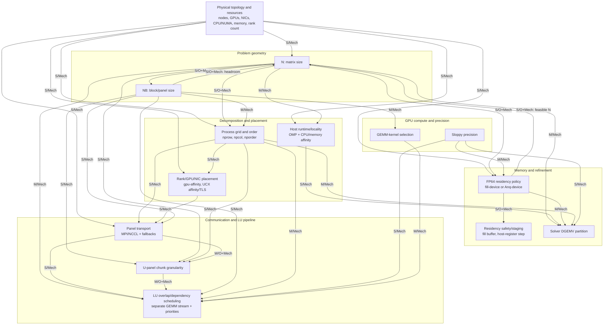

# HPL-MxP Parameter Dependency Graph from the 8×H200 Work

Scope: NVIDIA HPL-MxP v26.02 on one GAAS node with eight H200 GPUs. This is
an optimization-dependency model, not a new optimization blueprint. An arrow
`X → Y` means that X should normally be established before Y and that a
material change to X can invalidate Y's tuning conclusion. It does not assert
strict mathematical causality.

Numerical optima do not transfer between materially different hardware
topologies. The same rule applies to a materially different operating regime
on one topology: a downstream conclusion is closed only inside its tested
`N`/`NB`/grid/residency/precision/communication/host-runtime envelope.
Materiality is determined by changed system behavior—such as an FP64-residency
transition, a large `T_IR/T_LU` shift, changed local matrix ownership, or a new
communication path—not by a universal percentage threshold.

Evidence labels are deliberately strict:

- `OBSERVED`: the repository contains a cross-context, factorial, or trace
  comparison that bears directly on the interaction. A main effect at only
  one fixed control is not enough by itself.
- `MECHANISTIC`: the dependency follows from the blocked LU/refinement
  algorithm or the CPU/GPU/network/memory hierarchy, but the interaction was
  not isolated experimentally.
- `UNCERTAIN`: the interaction is plausible and important, but the available
  experiment design cannot establish its sign or materiality.

For tuning intuition at large N, the reported score is approximately
`R_MxP ≈ ((2/3)*N^3)/(T_LU+T_IR)`, equivalently
`R_MxP ≈ P_LU/(1+T_IR/T_LU)`. The graph therefore tracks effects on the
combined LU plus iterative-refinement critical path. A faster LU alone is not
necessarily a faster valid HPL-MxP result.

## 1. Parameter/Subsystem Inventory

The inventory separates parameters actually varied from important controls
that were held fixed. Numerical winners are statements about this 8×H200
single-node workload only.

| Subsystem | Parameter or group | What it controls / main mechanism | Strongest 8×H200 insight |
|---|---|---|---|
| Problem geometry | `--n` (`N`) | Global matrix dimension; cubic credited work, quadratic FP64 storage, GEMM/panel geometry, overhead amortization, and refinement volume/staging. | Raising N from 370000 to 490000 at `NB=1024` improved the score, while the fill-device N resweep showed that lowering N cut IR but lost LU efficiency under its fixed 2×4-row stack. `SingleNode-resweep_v1.1` later found a much faster smaller-N bundle with a lower `T_IR/T_LU`; this proves the old N closure was regime-conditional, but does not isolate which changed downstream flag recovered LU efficiency. [N sweep](../analysis/n-sweep-370k-510k.md), [residency/N study](../analysis/matrix-placement-N-resweep.md), [bundled record](../../experiments/SingleNode-resweep/README.md) |
| Problem geometry | `--nb` (`NB`) | Block/panel width; changes panel count and size, trailing-GEMM shapes, synchronization frequency, workspace, and communication granularity. | At N=490000, 1024→3072 cut LU time by about 6.4 s and raised performance 18.77% over the fixed-N control. 3072–6144 was a broad plateau; 7168/8192 regressed and headroom fell sharply. The absolute value 3072 is not universal. [NB sweep](../analysis/nb-sweep.md), [M1 interpretation](../consolidate_m1.md) |
| Decomposition | MPI rank count; `--nprow`, `--npcol`, `--nporder` | Rank count sets available parallelism; P×Q defines process rows/columns, local matrix ownership, and panel/update communicators; order maps ranks into the logical grid. | Rank count stayed fixed at eight. At N=399360, 4×2 column was best; at N=491520, 2×4 row was best, although the latter full spread was only about 1.8%. The new N=356352 record used 4×2 row as part of a multi-parameter bundle, so it reinforces reopening but is not isolated evidence that small N prefers 4×2. [Grid study](../analysis/np-sweep.md), [bundled record](../../experiments/SingleNode-resweep/README.md) |
| Device and network placement | `--gpu-affinity`; `--ucx-affinity`, `--ucx-tls` | Maps logical ranks to GPUs and network devices/transports; determines whether process-row/column traffic follows favorable NVSwitch, PCIe, NUMA, and NIC paths. | GPU affinity was always the identity map `0:...:7`; no alternate GPU map was tested. UCX/NIC controls were not swept. Their apparent irrelevance is therefore not an experimental result. [Tuning guide](../../HPL_MxP_TuningParam_Guide.md) |
| Host runtime and locality | `--cpu-affinity`, `--mem-affinity`; `OMP_NUM_THREADS`, `OMP_PLACES`, `OMP_PROC_BIND`; fixed host-thread support | Supplies CPU work for launches, MPI progress, panel/auxiliary work, data movement, and refinement; controls core and NUMA contention. | Explicit HPL CPU/memory affinity did not help at the tested control; fewer than eight cores/rank was disastrous. Separately, OpenMP 8 threads with socket placement was about 5.15% above the pre-OMP reference. `cores` plus binding collapsed because ranks oversubscribed low-numbered cores. [Affinity](../analysis/affinity-491k.md), [OpenMP](../analysis/omp-sweep.md) |
| FP64 residency | `--fill-device`, `--Anq-device` | Chooses how much of the original FP64 matrix remains device-resident for residual/refinement work. Residency changes host-device staging, `T_IR`, VRAM headroom, and therefore the useful operating regime; `fill-device` overrides `Anq-device`. | Under fill-device, lowering N from 491520 to 368640 cut solver time from 13.07 s to 4.09 s. That fixed-stack study lost matching LU efficiency, but the later bundled N=356352 record shows that a high-residency/small-IR regime can win globally when the surrounding stack preserves enough LU efficiency. Exact byte-level residency and isolated fill benefit remain unresolved. [Residency/N study](../analysis/matrix-placement-N-resweep.md), [bundled record](../../experiments/SingleNode-resweep/README.md) |
| Residency safety and staging | `--fill-device-buffer-size`, `--cuda-host-register-step` | Buffer reserves VRAM for workspaces/runtime; registration step batches pinned host FP64 columns and trades registration overhead against transfer efficiency. | Buffer 1024–2048 MB was a safe, flat region; 512/256 MB caused stalled residuals and failed verification. Register-step changes were within noise in two placement contexts. [Matrix placement](../analysis/matrix-placement-491k.md) |
| Panel communication | `--use-mpi-panel-broadcast`; diagnostic `--mpi-use-mpi`, `--use-host-mpi` | Selects the MPI/NCCL panel-broadcast mix, MPI fallback, or host-staged MPI. This changes GPU collective work, MPI traffic, progress, and synchronization. | A clean 0/25/50/75/100 sweep was inside 2.6% same-job drift. Nsight nevertheless confirmed real transport substitution. The later record used broadcast 100 in a bundled regime and does not isolate a benefit over 50; both remain conditional controls. [Communication study](../analysis/mpi-nccl-coms-sweep.md), [trace study](../mpi_panel_broadcast_effect.md) |
| U-panel granularity | `--u-panel-chunk-nbs` | Chunks U-panel work in units of NB; trades readiness/overlap against launch, collective, and scheduling overhead. | Values 4/8/16 were performance-flat at broadcasts 50 and 75. Chunk 4 increased dominant-kernel launches about 76.5% and NCCL launches about 5.9%, proving a structural change without a shorter clean critical path. [Chunk study](../panel_u_chunk_effect.md) |
| LU dependency scheduling | `--prioritize-factorization`, `--prioritize-trsm` | Makes GEMMs wait for the whole factorization or only U-side TRSM, advancing dependency-producing work on the LU critical path. Its value depends on panel/update geometry and readiness. | The 2×2 same-job test isolated factorization priority at N=491520/2×4 row: LU 20.38→19.12 s and end-to-end +3.54%; TRSM priority was neutral. The new record used factorization priority 0 in a bundled smaller-N regime, which reopens scheduling but does not isolate a reversal. [Priority study](../analysis/factorization-priority.md), [bundled record](../../experiments/SingleNode-resweep/README.md) |
| GPU concurrency | `--use-separate-stream-for-gemm` | Places GEMM on a dedicated CUDA stream, permitting overlap where dependencies and resources allow. | Disabling the stream, while factorization priority was enabled, cost 3.73% in LU rate and 1.89% end-to-end. It was not tested factorially with factorization priority. [Stream study](../analysis/separate-stream-for-gemm.md) |
| Solver-side host work | `--call-dgemv-with-multiple-threads` | Partitions local matrix rows per host thread in the refinement path; its useful granularity depends on N/residency, `nprow` ownership, CPU/cache/NUMA resources, and MPI progress. | At N=491520/2×4 row with OMP=8/socket placement, every tested nonzero value slowed the solver while LU and convergence stayed flat. The later bundled N=356352/4×2-row record used 15360; this does not prove a DGEMV benefit, but it prevents treating zero as closed outside the old IR/ownership regime. [DGEMV study](../analysis/dgemv-with-multiple-threads.md), [bundled record](../../experiments/SingleNode-resweep/README.md) |
| GPU compute and numerical path | `--sloppy-type`, `--preset-gemm-kernel` | Selects low-precision type/preconditioner quality and the GEMM implementation; changes tensor-core throughput, data volume, kernel duration, refinement iterations, and possibly memory demand. | All scored work used FP16. The effective preset was 90 in the profiled final control and the dominant kernel was SM90 `nvjet`; neither sloppy type nor alternative supported presets were swept. No winning conclusion exists. [Compute/scheduling evidence](../optimization_plan_1.md) |
| Validation / measurement controls | `--tolerance`, `--skip-tests 0`, `--monitor-gpu 0`, diagnostic monitoring, loop/repetition policy | Defines correctness acceptance, comparability, and observability rather than the mathematical optimization. | Comparable scored runs now keep internal tests enabled and continuous benchmark monitoring disabled; a monitored troubleshooting run is a labeled diagnostic condition. Every scored run still requires finite-residual `PASSED` verification. These controls do not create optimization edges. [Sweep blueprint](../blueprint/HPL_MxP_Sweep_Blueprint.md) |

Parameters in the last three rows that were fixed or diagnostic are included
because changing them can reopen a downstream conclusion even though they did
not supply a completed sweep.

## 2. Dependency Graph

Graph labels use `S`, `M`, and `W` for strong, moderate, and weak/conditional;
`O`, `Mech`, and `U` mean observed, mechanistic, and uncertain. `O+Mech`
means that both experiment evidence and a system mechanism support the edge.
The high-level graph deliberately groups flags that share the same dependency
structure; internal group interactions are expanded in the edge table.

Textual reading order:

1. Establish the hardware/resource envelope and MPI rank count.
2. Treat `N` and `NB` as a coupled geometry/memory pair, not independent
   permanent decisions.
3. Establish the process grid/order, then map its ranks to GPUs, NICs, CPUs,
   and memory domains.
4. Establish FP64 residency and safe headroom before fine staging controls;
   judge the useful N regime by both LU efficiency and IR cost.
5. With geometry and placement stable, interpret panel transport and U-panel
   chunking; only then interpret LU stream/priority behavior.
6. Precision and GEMM-kernel changes can reopen both scheduling and refinement
   conclusions because they change the relative lengths of those paths.
7. A material N or local-row-ownership change can also reopen scheduling or
   DGEMV even when the hardware topology itself is unchanged.

This is a dependency order, not the requested future sweep blueprint.

## 3. Dependency Edge Table

`Fully re-sweep` means the old downstream conclusion should be considered
open. `Lightly revalidate` means repeat controls and a small representative
set. `Normally keep closed` applies only while the upstream conditions remain
inside the tested regime.

| ID | Upstream parameter/group | Downstream parameter/group | Strength | Evidence | Why dependency exists | Revisit implication |
|---|---|---|---|---|---|---|
| E01 | Physical topology/resources and rank count | `N` | Strong | MECHANISTIC | Aggregate/per-rank host and device memory, rank-local work, and communication overhead set the safe useful problem size. | Fully re-establish feasible N after node/GPU count or memory-policy changes. |
| E02 | Physical topology/resources and rank count | Process grid/order | Strong | MECHANISTIC | Valid P×Q factors and the meaning of row/column groups change with rank count and node boundaries. | Fully re-sweep grid/order after moving 8→12 ranks or 1→3 nodes. |
| E03 | Physical topology/resources | Rank/GPU/NIC placement | Strong | MECHANISTIC | GPU numbering, NVLink/NVSwitch islands, PCIe roots, NUMA domains, NIC rails, and cpusets are machine-specific. | Fully remap placement; never copy the `0:...:7` or UCX assumptions blindly. |
| E04 | Physical topology/resources and ranks/node | Host runtime/locality | Strong | MECHANISTIC | Ranks compete for a different CPU/core/NUMA budget and MPI progress changes across nodes. | Fully re-sweep thread count/placement; rediscover the allocated cpuset. |
| E05 | Physical topology/resources | FP64 residency policy | Strong | MECHANISTIC | VRAM/rank, host memory/rank, runtime workspaces, and interconnect paths determine the value and safety of device residency. | Fully re-establish fill/partial-residency policy and headroom. |
| E06 | Physical topology/resources | Panel transport | Strong | MECHANISTIC | Crossing node/NIC boundaries changes latency, bandwidth, progress, collectives, and GPU-direct behavior. | Fully re-sweep communication policy on multinode; single-node flatness is closed only locally. |
| E07 | `N` | `NB` | Strong | OBSERVED + MECHANISTIC | N changes panel count, trailing-update sizes, amortization, and memory pressure. NB=3072 held up at two Ns, but was not re-swept under the final controls. [NB evidence](../analysis/nb-sweep.md) | Fully re-sweep NB after a major N change; lightly revalidate for small N movement away from a memory boundary. |
| E08 | `NB` | `N` / memory boundary | Strong | OBSERVED + MECHANISTIC | NB changes LU efficiency as well as workspace: the observed OOM boundary moved from 510000 at NB=1024 to 506880 at NB=3072, and another NB can shift the useful LU/IR balance across N. [Aligned-N evidence](../analysis/N-NB-resweep.md) | Recheck safe and useful N, headroom, and LU/IR balance after every material NB or workspace change. |
| E09 | `N` | Process grid/order | Strong | OBSERVED + MECHANISTIC (qualified) | The measured preference reversed from 4×2 column at N=399360 to 2×4 row at N=491520. The N=356352 bundled record used 4×2 row, but simultaneous changes prevent attributing its gain to grid; it reinforces reopening, not a directional rule. [Grid evidence](../analysis/np-sweep.md), [bundled record](../../experiments/SingleNode-resweep/README.md) | Fully re-sweep grid after a material N/residency/local-geometry regime change; never preserve the old winner by default. |
| E10 | `NB` | Process grid/order | Moderate | MECHANISTIC | Block-cyclic ownership, panels/rank, local update shapes, and communicator traffic depend jointly on NB and P×Q. Only NB=3072 was used in the final grid sweep. | Lightly revalidate grid after a modest NB change; fully re-sweep after a large change. |
| E11 | Process grid/order | Rank/GPU/NIC placement | Strong | MECHANISTIC | Order assigns physical ranks to logical row/column neighbors; the same affinity list can create different paths under another grid/order. | Rebuild the mapping for every serious grid candidate. |
| E12 | Process grid/order | Panel transport | Strong | MECHANISTIC | P and Q change communicator sizes, panel ownership, message fan-out, and inter-/intra-node traffic. Broadcast was swept only at 2×4 row. | Fully re-sweep panel transport after a material grid/topology change. |
| E13 | Rank/GPU/NIC placement | Panel transport | Strong | MECHANISTIC | MPI/NCCL performance depends on the physical GPU/NIC/NUMA route followed by logical communicators. | Fully revalidate transport after any rank/GPU/NIC remap. |
| E14 | `N` | FP64 residency policy | Strong | OBSERVED + MECHANISTIC | N² changes the original FP64 footprint and therefore device residency, host-device staging, `T_IR`, and the final LU/IR balance. Under fill-device, reducing N from 491520 to 368640 cut solver time 13.07→4.09 s but lost LU efficiency in that fixed stack; the later smaller-N bundle shows this IR reduction can be globally profitable when surrounding controls preserve enough LU efficiency. It does not isolate exact residency bytes or a downstream flag effect. [Residency/N evidence](../analysis/matrix-placement-N-resweep.md), [bundled record](../../experiments/SingleNode-resweep/README.md) | Fully re-evaluate residency and the LU/IR operating regime after a material N change; judge end-to-end score, not capacity or LU alone. |
| E15 | FP64 residency policy | Feasible/useful `N` | Strong | OBSERVED + MECHANISTIC | Residency changes VRAM headroom, FP64 staging, and `T_IR`; unsafe reserves caused invalid refinement, while a residency transition can change which N best balances credited work, LU efficiency, and IR cost. | Recheck N feasibility, correctness, and the useful LU/IR region whenever fill/Anq policy materially changes. |
| E16 | `--fill-device` / `--Anq-device` mode | Fill buffer | Strong | OBSERVED + MECHANISTIC | The buffer only governs fill-device headroom; too little reserve overflowed the intended residency and produced failed residuals. [Buffer evidence](../analysis/matrix-placement-491k.md) | Re-sweep a safe coarse buffer range after N, NB, release, or residency changes; correctness-gate every point. |
| E17 | Residency amount / host-resident fraction | Host-register step | Weak / conditional | OBSERVED + MECHANISTIC | Registration matters only for host-resident/staged FP64 data. Sweeps at two buffers found no stable winner above noise. [Placement evidence](../analysis/fp64-matrix-mem-placement.md) | Normally keep default closed; lightly revalidate only after a large residency or interconnect change. |
| E18 | `N` / per-rank refinement work | Host runtime/locality | Moderate | MECHANISTIC | A different N/residency regime changes residual/refinement, staging, and launch workloads and can shift the useful host-thread budget. The new record retained OMP=8/socket placement, so it adds no isolated host-runtime comparison. | Lightly revalidate OMP at a materially different N/IR regime or ranks/node; do not strengthen without a controlled host-runtime comparison. |
| E19 | CPU/memory affinity | OpenMP thread/place/bind policy | Strong | UNCERTAIN | Both act on the same cpuset and NUMA resources. They were optimized sequentially, not as a clean joint design; the early 10-thread failure mixed affinity and OpenMP settings. | Fully revalidate as a coordinated group on a new launcher/cpuset; do not combine old winners independently. |
| E20 | Host runtime/locality | DGEMV partition | Strong | MECHANISTIC | DGEMV threads share cores, caches, NUMA paths, and MPI progress resources. The negative controlled sweep used only OMP=8/socket placement in the large-N regime. | Fully re-sweep after a major host-runtime/resource change; otherwise retain zero only as the conditional control for the tested host regime. |
| E21 | `N` and FP64 residency | DGEMV partition | Moderate | MECHANISTIC | DGEMV/refinement size, FP64 staging, and whether partition overhead can be amortized change across N/residency/IR regimes. The bundled record's 15360 value is not isolated evidence of benefit. | Within the same N/residency/host regime, keep the prior conclusion or lightly revalidate. After a major residency or `T_IR/T_LU` regime shift, fully reopen DGEMV if IR remains material. |
| E22 | `NB` | Panel transport | Strong | MECHANISTIC | NB changes panel message size/frequency and the latency-versus-bandwidth balance. The communication sweep used only NB=3072. | Fully re-sweep MPI/NCCL policy after a large NB change. |
| E23 | `NB` | U-panel chunk size | Strong | MECHANISTIC | Chunk units are NB blocks; changing NB changes bytes/chunk, number of chunks, kernel shapes, and readiness cadence. | Fully re-sweep chunk candidates after a large NB change. |
| E24 | `N`, `NB`, `npcol` | U-panel chunk validity/usefulness | Strong | MECHANISTIC | NVIDIA's documented constraint contains `(N/NB)/npcol/chunk`; the work per process column changes with all three. | Recalculate validity and fully re-evaluate chunk after geometry/grid changes. |
| E25 | Panel transport | U-panel chunk interpretation | Weak / conditional | OBSERVED + MECHANISTIC | Chunks 4/8/16 were compared at broadcasts 50 and 75 with no resolved performance interaction, although traces showed changed collective launch structure. [Communication matrix](../analysis/mpi-nccl-coms-sweep.md) | Normally keep 8 closed at the current control; lightweight joint revalidation after topology/grid changes. |
| E26 | Panel transport/readiness | LU stream and priority policy | Strong | MECHANISTIC | Priority and stream choices operate on readiness stalls created partly by communication; another transport/topology changes which dependency is critical. | Fully re-sweep priority/stream controls after moving multinode or materially changing transport. |
| E27 | U-panel chunk | LU stream and priority policy | Moderate | OBSERVED + MECHANISTIC | Chunk 4 changed kernel/collective launch counts and moved synchronization without shortening the clean path. This can change what stream/priority policy has to hide. [Trace evidence](../panel_u_chunk_effect.md) | Lightly revalidate scheduling after a major chunk change; keep closed for 4/8/16 at the present control. |
| E28 | `NB` | LU stream and priority policy | Strong | MECHANISTIC | Panel duration/frequency and GEMM duration determine whether factorization or TRSM is starved by updates. Priority was tested only at NB=3072 and one large-N/grid regime. | Fully re-sweep scheduling after a large NB change; keep the old priority result only inside its tested geometry. |
| E29 | Process grid/order | LU stream and priority policy | Moderate | MECHANISTIC | Panel ownership, rank arrival skew, local update geometry, and concurrency change with P×Q. | Lightly revalidate after a small grid change; fully re-sweep when ownership, arrival behavior, or node-boundary crossings change materially. |
| E30 | Separate GEMM stream policy | Factorization/TRSM priority policy | Strong | MECHANISTIC + UNCERTAIN | Separate streams create concurrency; priority constrains it to protect the critical panel. The stream toggle was tested only with factorization priority on, so the interaction magnitude is unknown. | Treat them as a coupled scheduling group; use a factorial or targeted interaction check after either changes. |
| E31 | Factorization priority | TRSM priority interpretation | Moderate | OBSERVED + MECHANISTIC | The large-N 2×2 experiment showed factorization priority's benefit in both TRSM states and no additive TRSM benefit. The bundled smaller-N record used both priorities off, but does not isolate either effect. [2×2 evidence](../analysis/factorization-priority.md), [bundled record](../../experiments/SingleNode-resweep/README.md) | Keep TRSM=0 closed only at the tested scheduling control; reopen after material geometry, transport, precision, or factorization-policy changes. |
| E32 | Sloppy precision | LU scheduling and panel communication | Strong | MECHANISTIC | Precision changes GEMM/data-movement duration and preconditioner quality, shifting the balance between update work and panel readiness. No alternate precision was tested. | Fully re-sweep the highest-impact scheduling/communication controls after changing precision. |
| E33 | GEMM-kernel selection | LU scheduling | Moderate | MECHANISTIC | A faster/differently tiled GEMM changes how long updates occupy resources and whether they starve factorization. Only effective preset 90 was observed. | Lightly revalidate factorization priority and stream policy after a kernel change. |
| E34 | `NB` | GEMM-kernel selection | Moderate | MECHANISTIC | NB determines important GEMM shapes and K dimensions; a kernel/preset result need not transfer across blocks. | Lightly revalidate the kernel after NB changes and vice versa. |
| E35 | Sloppy precision | Solver/refinement and DGEMV policy | Strong | MECHANISTIC | Lower precision can weaken the LU preconditioner, increase refinement iterations, or fail convergence; that changes solver-side work. | Fully revalidate solver behavior, DGEMV conclusion, residuals, and end-to-end time after precision changes. |
| E36 | Sloppy precision | Memory headroom/residency | Moderate | MECHANISTIC | Low-precision factor/copy size and workspaces compete with FP64 residency and communication buffers. | Recheck VRAM headroom, safe fill buffer, and N feasibility after precision changes. |
| E37 | `N` / problem scale | LU stream and priority policy | Moderate | MECHANISTIC | N changes panel count, GEMM sizes/durations, overhead amortization, and the panel/update balance that determines whether GEMMs starve dependency-producing work. The opposite factorization setting in the bundled record is not an isolated interaction test. | Fully reopen scheduling after a material N/LU-geometry regime change; use light revalidation for small local N movement inside the same regime. |
| E38 | Process grid / `nprow` | DGEMV partition | Moderate | MECHANISTIC | `nprow` changes local matrix-row ownership and solver communication, which changes the DGEMV work per rank and the granularity at which rows/thread can amortize overhead. No controlled grid×DGEMV comparison exists. | Revalidate DGEMV after a grid change when IR is material; fully reopen only when local-row ownership or solver behavior changes materially. |

A machine-readable copy of this table is provided in
[`edges.csv`](edges.csv). The CSV keeps the same evidence and revisit semantics
but omits Markdown citations.

## 4. Observed vs Mechanistic Dependencies

The numerical cross-check used [`results/metrics.csv`](../../results/metrics.csv)
and [`results/RESULTS.md`](../../results/RESULTS.md), with phase timing,
memory, residual, and configuration markers checked in the relevant raw
experiment outputs. The detailed reports linked below retain the attempt IDs,
PBS jobs, nodes, and raw-output paths. The two consolidation reports
([M1](../consolidate_m1.md), [M2](../consolidate_m2.md)) were used to reconcile
later corrections with earlier interpretations rather than simply inheriting
the latest winning configuration.

`SingleNode-resweep_v1.1` is bundled operating-regime evidence. It establishes
that the old full-stack optimum and several downstream closures were
conditional: the smaller-N bundle reached `2.7694e+06` GFLOP/s with slightly
lower LU throughput but much lower IR time (`3.44 s` versus `13.58 s`) and a
lower `T_IR/T_LU` ratio (about `0.46` versus `0.71`). Because N, grid, DGEMV,
factorization priority, broadcast, and fill buffer changed together, it does
not promote any corresponding pairwise dependency to `OBSERVED` or establish
the sign of an individual flag effect.

### Directly observed interaction evidence

- **`N ↔ NB` through capacity and LU granularity.** NB=3072 reduced LU time
  substantially at N=490000, and the larger workspace moved the observed OOM
  boundary below the NB=1024 boundary. This supports a dependency, but not a
  universal NB optimum.
- **`N → grid/order`, qualified.** The winner changed between the 399360
  and 491520 studies. Because the studies were cross-node and did not share
  every later control, the reversal is an observed warning to reopen the grid,
  not a clean quantitative interaction estimate. The bundled N=356352/4×2-row
  record reinforces the need to reopen but is not another isolated grid test.
- **`N ↔ FP64 residency`.** The fill-device N re-sweep directly showed a
  monotonic solver-time reduction at smaller N and a simultaneous LU-efficiency
  loss. The old net-null conclusion applied to its fixed downstream stack; the
  later bundled record demonstrates that the low-IR regime can become globally
  competitive when enough LU efficiency is recovered elsewhere.
- **Residency mode → buffer safety.** The low-buffer failures are a strong
  correctness dependency, not ordinary slow points. The exact 1024-versus-2048
  ranking remains unresolved.
- **Panel transport ↔ U-panel chunk was tested and weak here.** The partial
  joint matrix at broadcasts 50/75 and chunks 4/8/16 showed no clean
  end-to-end interaction. Nsight proved that both knobs changed execution
  structure even when score stayed flat.
- **Factorization priority ↔ TRSM priority was tested factorially.** The
  whole-factorization effect repeated across both TRSM states; TRSM added
  nothing. This is stronger than selecting a single maximum.

### Observed main effects that are not interaction proofs

- OpenMP socket placement was beneficial and narrow CPU binding was harmful,
  but explicit affinity and OpenMP were not jointly swept. Their edge remains
  uncertain rather than observed.
- The separate GEMM stream was useful with factorization priority enabled, but
  there is no stream×priority factorial evidence.
- DGEMV partitioning was harmful at one OMP/FP16/residency control. This does
  not prove it remains harmful under another host budget, local-row ownership,
  or refinement regime. The bundled 15360 setting is not isolated counterevidence.
- Panel broadcast and chunk were flat at one N/NB/grid/topology. Their
  negative result is valuable but conditional.

### Mechanistic dependencies not isolated by these experiments

- Grid/order → GPU/NIC placement → panel transport.
- NB → message size/frequency, U-panel chunk bytes, GEMM shapes, and
  factorization/update scheduling balance.
- Host runtime → MPI progress and DGEMV partition usefulness.
- N/problem scale → LU priority/stream usefulness through panel/update
  geometry and critical-path balance.
- Process grid/`nprow` → DGEMV usefulness through local row ownership and
  solver work per rank.
- Sloppy precision → preconditioner quality, refinement work, residency
  pressure, and the relative value of scheduling controls.
- GEMM-kernel choice → update duration and factorization starvation.
- Node count/interconnect → all communication and rank-placement choices.

### Unknown or genuinely uncertain edges

- Whether coordinated CPU affinity plus the winning OpenMP socket policy is
  better or worse than leaving HPL affinity unset.
- Whether the final OpenMP/fill/factorization controls change the preferred
  NB or process grid.
- Whether factorization priority remains beneficial with another precision,
  N regime, NB, process grid, or inter-node panel path.
- Whether DGEMV 15360, factorization priority 0, broadcast 100, the 4×2 grid,
  or the changed fill buffer contributes independently to the bundled record.
- Whether partial `Anq-device` residency has a useful region with
  `fill-device=0`.
- Whether any H200-supported preset differs beneficially from the effective
  preset 90.

The earlier `basic_param_sweep2.md` claim that N/NB divisibility was mandatory
should not be retained as a general rule. Repeated pathological 402423/403423
measurements showed that a specific case was real, but the later aligned-N
study found no general alignment benefit and several aligned points below the
unaligned reference. The transferable dependency is memory/work granularity,
not "always choose `N % NB == 0` for speed." [Early interpretation](../analysis/basic_param_sweep2.md),
[later correction](../analysis/N-NB-resweep.md)

## 5. Potentially Missed Interactions

The strongest cross-cutting lesson from `SingleNode-resweep` is procedural:
the old sequential campaign sometimes retained a downstream winner as a
permanent control while continuing to change upstream geometry. The much
faster bundled operating regime demonstrates why the graph's dependency-
triggered reopening must be actively enforced. It validates the importance of
several existing reopen rules, but does not identify which bundled flag caused
the gain.

1. **NB was never re-swept under the final stack.** The decisive NB sweep
   preceded OpenMP socket placement, fill-device, factorization priority, and
   the final communication control. Because NB changes GEMM size, memory
   headroom, panel frequency, and priority balance, calling NB permanently
   closed is stronger than the evidence supports. The new smaller-N bundle
   retained NB=3072, but one bundled point does not establish NB as invariant.

2. **The final grid was never re-swept after host, residency, or scheduling
   changes.** The 2×4-row advantage at N=491520 was only 1.1–1.8% and the
   winner had already reversed once with N. OMP socket placement and
   fill-device can change NUMA/staging balance; factorization priority can
   change the cost of panel ownership. The bundled N=356352 record uses 4×2
   row but does not isolate grid. The old grid choice is a conditional control,
   not a robust universal optimum.

3. **Affinity and OpenMP were optimized sequentially with a confounded early
   failure.** The project never ran a clean matrix crossing no/explicit CPU
   affinity with sockets/cores OpenMP placement. Both manipulate the same CPU
   placement. The conclusion "no affinity" is valid for the tested setup but
   cannot be freely combined with a different launcher binding policy.

4. **Fill-device's magnitude and exact buffer winner are weaker than earlier
   wording suggests.** Fill-off and fill-on landed on different-performing
   nodes; 1024 versus 2048 was sub-percent and cross-node. What is well
   established is that device residency changes IR and that the invalid cliff
   at 512 MB or below is real, not that residency has only a modest global
   payoff or that one buffer is uniquely optimal. The new record used buffer
   3048 in a bundle and does not isolate that value.

5. **Priority and stream policies were not tested as one interaction.** The
   2×2 priority test held the separate stream enabled; the stream toggle held
   factorization priority enabled. A stream×factorization design is missing,
   so the old result supports the pair `(stream=1, factorization=1)` only in
   its large-N geometry and does not quantify synergy or transfer to the
   bundled smaller-N regime.

6. **The communication conclusion is narrow.** Broadcast and chunk were tested
   only at N=491520, NB=3072, 2×4 row, one node, identity GPU affinity, and
   one effective CUDA-aware MPI path. UCX device/transport, MPI fallback,
   host-MPI, alternate grid, and alternate GPU-rank mapping were not tested.
   Broadcast 100 in the bundled record does not isolate a reversal of the
   earlier flat result.

7. **DGEMV's negative result is conditional on the host/refinement regime.**
   It was tested only with OMP=8/socket placement, FP16, full device fill, and
   one N/grid. The bundled record changes N, grid, residency balance, and
   DGEMV together, so 15360 is unresolved rather than a winner. A major IR
   shift, changed `nprow` row ownership, a precision change, or a 4-rank-per-
   node layout that frees CPU cores should reopen the partition when IR is
   material.

8. **Precision and GEMM kernel were not explored, despite being upstream of
   several "closed" scheduling decisions.** FP4/FP8 may change LU speed,
   preconditioner quality, refinement iterations, VRAM footprint, message
   volume, and the need for factorization priority. Effective preset 90 was
   observed, not compared.

9. **Partial FP64 residency was not tested.** `fill-device` overrides
   `Anq-device`, so the latter requires a separate fill-off study. It could
   matter when full fill is unsafe on another geometry, but no 8×H200 result
   establishes a useful setting.

10. **Rank count and multinode mapping were never varied.** Every scored run
    used eight ranks on one NVSwitch node. There is no experimental evidence
    about inter-node rank ordering, NIC affinity, hierarchical collectives, or
    three-node arrival skew.

11. **Many small winners lack enough replication.** Same-node bracketing
    exposed 1.6–2.6% temporal drift, while most cells have one measurement.
    Factorization priority has a convincing internal 2×2 pattern but no
    cross-allocation bracketed repeat. Grid/order and register/buffer rankings
    below roughly 1–2% should not be treated as resolved.

12. **Package/release state is an untested upstream variable.** The repository
    notes a mismatch between online/default-looking documentation and the
    effective v26.02 values (for example panel-broadcast 50 and preset 90).
    A package/CUDA/MPI change can invalidate transport and kernel conclusions
    even on the same hardware.

These are missing dependencies or experiments, not a proposal for the next
sweep sequence.

## 6. Implications for Moving from 8×H200 Single Node → 3×4 H200 Multinode

The move changes more than GPU count. It introduces two network boundaries,
changes ranks/node from eight to four, changes the valid P×Q factor set, and
changes how logical process rows/columns can align with physical nodes.

| Prior 8×H200 conclusion | Transferability | Dependency implication for 3×4 H200 |
|---|---|---|
| `N=491520` or the newer `N=356352` | Low | Re-establish N around the new system's FP64-residency transition using aggregate/per-rank memory, usable VRAM, workspace, and the communication/amortization balance. Neither single-node N transfers; the reusable lesson is to measure LU efficiency and IR together. |
| `NB=3072` | Low–medium as a starting hypothesis only | Inter-node message latency/bandwidth, different local matrix shapes, and a different grid can shift the useful NB range and memory wall. Reopen NB after the new geometry/grid is established. |
| `2×4 row` or the newer `4×2 row` | Very low | Twelve ranks admit 1×12, 2×6, 3×4, 4×3, 6×2, and 12×1. A 3×4 row-major layout could align four contiguous ranks with each node, but that is a mechanism-based candidate, not an optimum. Grid and order must be retuned together with mapping. |
| Identity GPU affinity | None as a global map | Define local-rank-to-GPU mapping on each node and verify GPU, NUMA, PCIe, and NIC locality. Global rank order must be evaluated against the chosen P×Q communicators. |
| No explicit CPU/memory affinity; OMP=8 sockets/TRUE | Low | Four ranks/node have a different core budget, and `OMP_PLACES=sockets` may place threads differently under the multinode launcher/cpuset. Rediscover CPU visibility and coordinate MPI, OpenMP, CPU, and memory policies. |
| `fill-device=1`, historical buffers 1024–2048 or bundled 3048 | Low–medium | Per-GPU VRAM is similar, but local matrix ownership, communication buffers, MPI/NCCL workspaces, and the selected N/grid change headroom and IR staging. Preserve the residency/correctness mechanism, not an exact N or MB value. |
| Broadcast 50 was flat; bundled record used 100; chunk 8 | Very low | Inter-node traffic makes transport, UCX/NIC selection, MPI progress, and chunk/message cadence first-order candidates. Neither broadcast percentage is a transferable winner; the single-node result is reopened. |
| Historical factorization priority 1; bundled record used 0; TRSM 0 | Medium at best | The dependency mechanism is transferable, but N/panel geometry and network arrival can change the benefit of priority. Neither factorization value transfers; revalidate after geometry, grid, transport, and chunk decisions. |
| Separate GEMM stream 1 | Medium | Dedicated-stream concurrency is generally plausible, but its value depends on the new communication and priority balance. Retain only as an initial control, then revalidate. |
| Historical DGEMV 0; bundled record used 15360 | Low | More CPU cores per local rank, changed `nprow` ownership, and multinode refinement alter partition economics. Neither value transfers; reopen if IR is material after the new N/residency/grid/host regime is established. |
| FP16 and effective preset 90 | No comparative conclusion | They were held fixed, not optimized. Precision/kernel choices can alter the entire LU-versus-refinement balance and therefore invalidate memory and scheduling conclusions. |

The highest-risk transfer error would be to copy either the historical
`N=491520, NB=3072, 2×4 row, broadcast=50` stack or the newer
`N=356352, 4×2 row, DGEMV=15360, broadcast=100, factorization=0` bundle. Both
encode an eight-rank single-node NVSwitch regime. The transferable asset is
the dependency structure—especially deliberate exploration of the FP64-
residency transition and LU/IR balance—not either set of numbers.

## 7. Key Dependency Rules for the Future Blueprint

1. A change in node count, GPUs/node, rank count, or interconnect should reopen
   `N`, process grid/order, rank/GPU/NIC placement, host placement, FP64
   residency, and panel transport.
2. `N` is a first-order operating-regime variable because it changes credited
   work, LU/panel geometry and efficiency, the quadratic FP64 footprint, and
   IR staging/cost. A material N/residency regime change should trigger a full
   NB and grid re-sweep, re-establish residency/headroom, fully reopen DGEMV
   when IR remains material, and reopen scheduling when LU critical-path
   geometry has changed.
3. A major change in `NB` should trigger a new safe-N boundary check and
   revalidation of grid, panel transport, U-panel chunk, GEMM kernel, and LU
   scheduling.
4. A process-grid or rank-order change should trigger a fresh physical
   GPU/NIC/NUMA map, then revalidation of panel transport and scheduling.
5. Moving from single-node to multinode should fully reopen MPI/NCCL policy,
   UCX/NIC placement, chunk granularity, and MPI-progress assumptions even if
   they were flat on the NVSwitch node.
6. CPU affinity, memory affinity, MPI binding, `OMP_NUM_THREADS`,
   `OMP_PLACES`, and `OMP_PROC_BIND` should be treated as one host-placement
   group; changing one can invalidate the others and the DGEMV result.
7. Changing FP64 residency (`fill-device` versus `Anq-device`) should trigger
   a new N/headroom check and a safe buffer validation. `Anq-device` is not a
   parallel knob while fill-device is enabled.
8. Fill-buffer decisions must be correctness-gated. A failed or stalled
   residual is an invalid configuration, not a performance regression.
9. Changing sloppy precision should reopen refinement/DGEMV, VRAM headroom,
   panel/communication balance, and the most important LU scheduling controls.
10. Changing GEMM kernel or NB should lightly revalidate each other and
    factorization/stream scheduling because update duration and shapes change.
11. Separate-stream and factorization/TRSM priority settings should be treated
    as a coupled scheduling group; a material change to either warrants an
    interaction check.
12. Judge a "major" change by mechanism and observed regime shift—not a fixed
    percentage. Examples include crossing an FP64-residency/staging boundary,
    a large `T_IR/T_LU` change, materially different local matrix ownership or
    panel/update balance, crossing node boundaries, changing precision, or
    changing host resources per rank.
13. A parameter is "closed" only within its tested N/NB/grid/topology,
    precision, residency, communication, and host-runtime envelope. Crossing
    that envelope reopens its downstream edges according to this graph.
14. Preserve negative results with their boundary conditions: broadcast/chunk
    flatness, TRSM neutrality, register-step flatness, and DGEMV regressions
    are useful conditional controls and priors, not universal constants.
15. Any claimed gain near the measured noise floor should use same-node or
    same-allocation bracketing/repetition. For a new topology, always report
    the immutable new-system original baseline as the percentage denominator
    and include percentage change from the local control alongside it. The
    historical `baseline-sweep_v1` value may be shown for context only; it is
    not the denominator for the 3-node × 4-GPU campaign.
